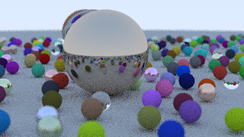
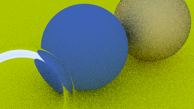
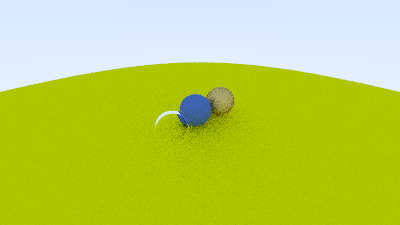

# Python Ray Tracer

A **CPU-based path tracer written in pure Python**, following the full
*Ray Tracing in One Weekend* book series.

This project is a from-scratch implementation aimed at deeply understanding
ray tracing, materials, light transport, and camera models, without relying
on GPU APIs or rendering frameworks.

---

##  Features

- Ray–sphere intersection logic
- Scene composition using hittable lists
- Surface normal visualization
- **Diffuse (Lambertian) materials**
- **Metal & dielectric (glass) materials**
- Recursive ray tracing with configurable depth
- Gamma correction
- Anti-aliasing via random sampling
- Configurable camera with FOV and depth of field
- Image output via Pillow (PIL)

---

##  Renders

Below are some example renders produced by the tracer.
(All images rendered entirely on the CPU.)

### Final Scene

### Defocus

### Depth of Field

> Final render time (Python, CPU): **~994 seconds**

---
##  Goals

- Build a **clear and readable reference ray tracer**
- Prioritize correctness and learning over raw speed
- Serve as a stepping stone to:
  - C++ / SDL / OpenGL implementations
  - BVH acceleration structures
  - Real-time or GPU-based renderers

---

##  Next Steps

### Performance Improvements (High Priority)
- Add **Bounding Volume Hierarchy (BVH)** for faster ray–object queries
- Reduce Python overhead in vector math
- Explore multiprocessing / tiled rendering
- Optional: NumPy-backed math experiments

### Rendering Features
- Importance sampling
- Textures (image & procedural)
- Emissive materials
- Motion blur

### Long-Term
- Port the core renderer to **C++**
- Compare Python vs C++ performance
- Experiment with real-time ray tracing concepts

---

##  References

- *Ray Tracing in One Weekend* — Peter Shirley
- *Ray Tracing: The Next Week*
- *Ray Tracing: The Rest of Your Life*

---

##  License

MIT License

