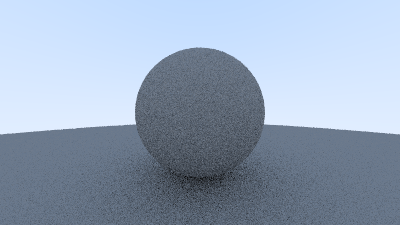

# Python Ray Tracer

A simple ray tracer written in **pure Python**, based on *Ray Tracing in One Weekend*.
This project is built as a learning exercise to understand rendering, geometry,
and Monte Carlo light transport from first principles.

## Features (so far)
- Ray–sphere intersections
- Multiple objects via hittable lists
- Surface normals visualization
- **Diffuse (Lambertian) scattering**
- Recursive ray tracing with depth control
- Simple camera model
- Image output using Pillow (PIL)

## Example Output

Diffuse sphere rendered using random hemisphere sampling:

## Goals
- Reach a clean **v1.0** CPU ray tracer in Python
- Improve image quality with sampling & gamma correction
- Experiment with performance improvements
- Later port concepts to C++ / SDL

## Status
🚧 Work in progress — currently exploring path tracing and materials.
